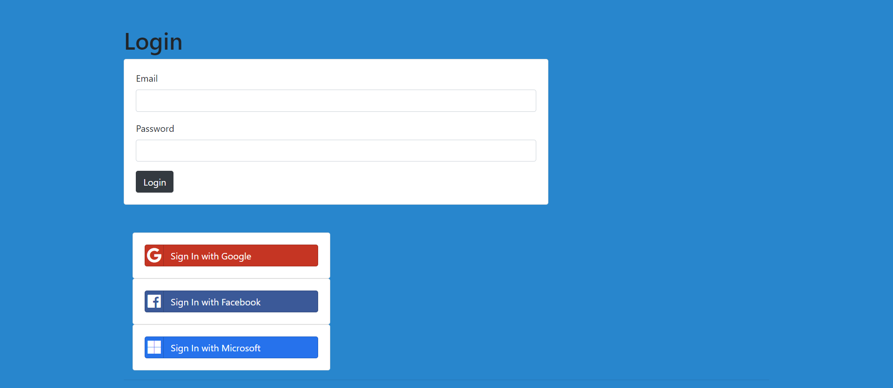
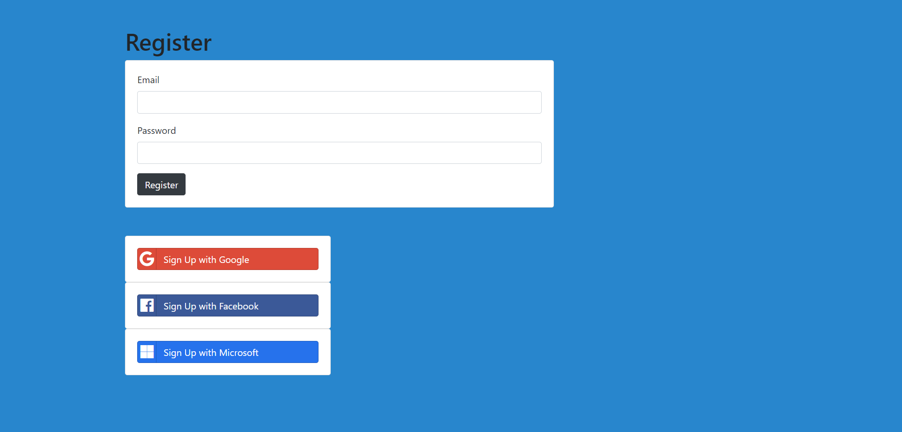
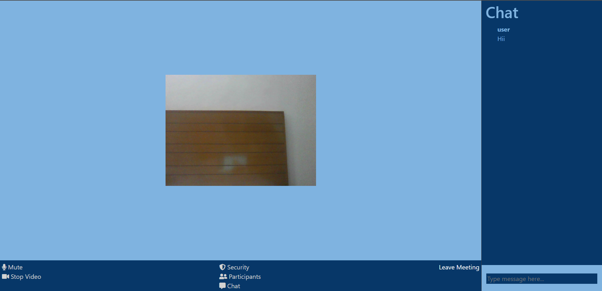
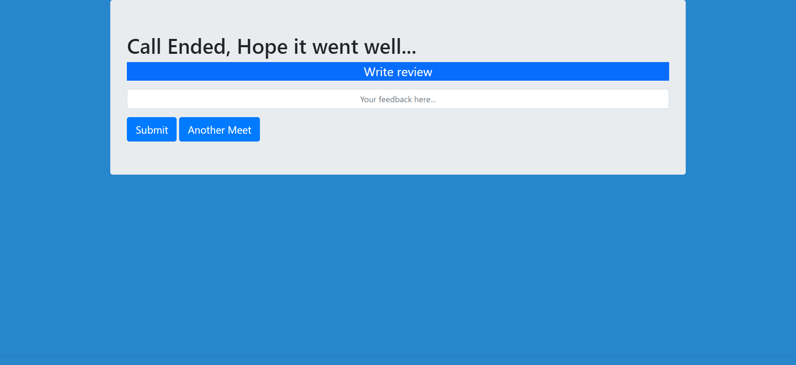

# Let's Meet (Video Call App)

### Follow the given steps for starting the app
```npm install```    
```npm start```    
Open http://localhost:3000 on your browser.  

### Features 
Video call  
Real Time Chat  
Picture-in-picture  

## App pages
  
  
  
  
  

### Group members
1-Mohit Sharma  
2-Khushi Agrawal  
